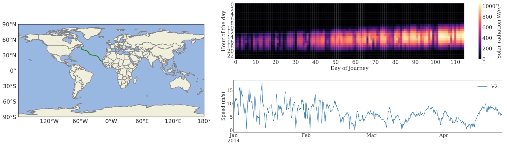
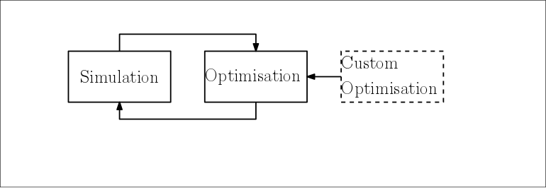

# D3HRE
Data Driven Dynamic Hybrid Renewable Energy (D3HRE) is a software suite to study hybrid renewable energy system on **moving platforms**. This package enables the simulation, optimisation and management of *spatial-temporal* hybrid renewable energy system e.g. on ships, airballons and airplanes.  

[](https://travis-ci.org/tsaoyu/D3HRE)
[](https://codecov.io/gh/tsaoyu/D3HRE)
[](https://zenodo.org/badge/latestdoi/129913383)

**Simulation:** D3HRE is able to simulate the hybrid renewable energy system on moving platforms at global scale. For example, the following study shows wind and solar power on a cross Atlantic mission taken by an autonomous surface vehicle. 



**Optimisation:** Simulation based design optimisation is another key function offered in D3HRE. Three build design optimisation approaches: multi-objectives optimisation (NSGA), mixed-objectives optimisation(PSO) and multi-level optimisation (NLOPT) give the best insight for the designer. For researcher it is also easy to extend and plug-in your own optimisation algorithm in the framework. 



**Management:** D3HRE furthur extend its capability in the study of power management system. It models after `OpenAI GYM`, make it possible to support conventional reactive, predictive and even reinforcement learning approaches at the same time. 


## Installation 

`pip install D3HRE`

## Requirements

Python >= 3
```
numpy
scipy
pandas
xarray
dask[complete]
netCDF4
ephem
seaborn
gpxpy
requests
pygmo
nvector
visilibity
```


## Citation
If you are using `D3HRE` in your research, please consider cite this software use DOI provided. 


